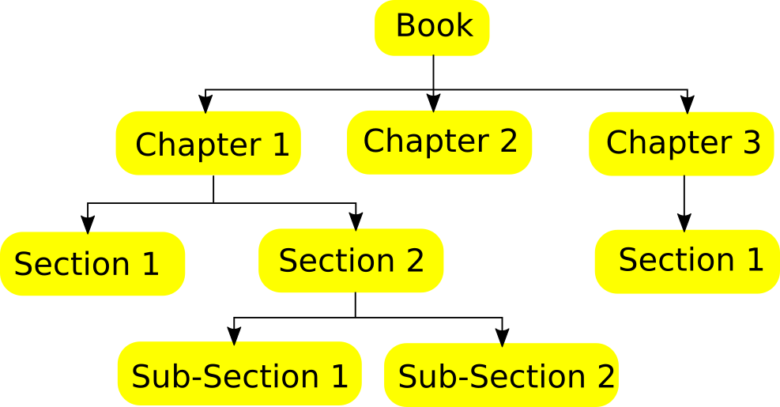

# NotesTree
[](https://www.python.org/)
[](https://github.com/ellerbrock/open-source-badges/)
[](https://lbesson.mit-license.org/)

NotesTree is a command line tool for maintaining handwritten notes in a tree structure using markdown.
This makes handwritten notes  easy to navigate when need to reffer it. Check [AI Notebook](https://github.com/notebook-org/robotics/blob/master/AI/index.md) built using NotesTree for example.

<p align="center">

</p>

## Install
```bash
git clone https://github.com/aditya-shriwastava/NotesTree.git
cd NotesTree
./install.py
# ./uninstall.py to uninstall
```

## Description
* A node in a NotesTree is stored as directory on disk.
* Every node will have have following:
    1. List of Appendices (*.md files) stored inside the Appendices directory.
    2. List of References stored in .reference file in markdown format.
    3. HandWritten note, stored as a sequence of pages as 1.jpg, 2.jpg, 3.jpg etc.
    4. Markdown notes, stored in Notes.md file.
    5. Child nodes, which are also a complete NotesTree in itself as sub directories.
    6. Autogenerated index.md file to view the NotesTree.
    7. Autogenerated .layout file which describes how child nodes will be displayed in index.md file.

### Appendices example
```
'./Appendices/Simple Kotlin Hello World Example.md'
'./Appendices/Kotlin Class Constructor Example.md'
```

### .reference file example
```Markdown
[Google](https://www.google.com://www.google.com/)
[Wikipedia](https://en.wikipedia.org/)
```

### .layout file example (Autogenerated)
```YAML
Order:
- "Chapter 1"
- "Chapter 2"
- "Chapter 3"
Ordered: True
```
### index.md file (Autogenerated)
```Markdown
# Book
1. [Chapter 1](./Chapter%201/index.md)
2. [Chapter 2](./Chapter%202/index.md)
3. [Chapter 3](./Chapter%203/index.md)

## Appendices
* [Simple Kotlin Hello World Example](./Appendices/Simple%20Kotlin%20Hello%20World%20Example.md)
* [Kotlin Class Constructor Example](./Appendices/Kotlin%20Class%20Constructor%20Example.md)

## References
* [Google](https://www.google.com://www.google.com/)
* [Wikipedia](https://en.wikipedia.org/)

<!--Markdown Notes will be pasted here-->

# HandWritten Notes
<p align="center">


</p>
```

## Tutorial
1. **Adding root** node named Book.
```sh
$ notestree add-root Book
```
  * In general:
  ```sh
  $ notestree add-root <root_name>
  ```
2. **Adding child** nodes Chapter 1, Chapter 2 and Chapter 3 to Book.
```sh
$ cd Book
$ notestree add-child 'Chapter 1'
$ notestree add-child 'Chapter 2'
$ notestree add-child 'Chapter 3'
```
  * In general:
  ```sh
  $ notestree add-child <child_name>
  ```
  * By default nodes will be added as ordered list, to convert from ordered to unorderde and vice versa, manually change the bool ordered in .layout file.
  * For changing the order of child nodes, manually change the  order array in .layout file.
3. **Deleting child** node Chapter 2 and Chapter 3.
```sh
$ notestree delete-child 'Chapter 2'
$ notestree delete-child 'Chapter 3'
```
  * In general:
  ```sh
  $ notestree delete-child <child_name>
  ```
4. **Rename child** node Chapter 1 to Part 1.
```sh
$ notestree rename-child 'Chapter 1' 'Part 1'
```
  * In general:
  ```sh
  $ notestree rename-child <old_child_name> <new_child_name>
  ```
5. **Detach and attach child** node Chapter 1 from it parent.
```sh
$ notestree detach-child 'Chapter 1'
$ notestree attach-child 'Chapter 1'
```
  * In general:
  ```sh
  $ notestree detach-child <child_name>
  $ notestree attach-child <child_name>
  ```
  * Detaching child node means making the child node a standalone NotesTree or it can be viewed as deleting link between child node and its parent. Attaching is just opposit of detaching.
6. **Updating** NotesTree
  * For updating index.md file of the current node.
  ```sh
  $ notestree update
  ```
  * For recursively updating index.md of current note as well as all its children nodes.
  ```sh
  $ notestree rupdate
  ```
7. **Insert hand-written notes** into a node of NotesTree.
  * It is assumed that:
    * ~/Public/ is the source directory from which images (i.e. hand-written notes) are inserted into NotesTree.
    * In ~/Public/ images are stored as 'X_1.jpg', 'X_2.jpg' etc.

  * Consider you have {'1.jpg', '2.jpg', '3.jpg', '4.jpg'} in your current node and you want to insert {'X_4.jpg', 'X_5.jpg', 'X_6.jpg'} from your source directory
    1. At index 3, 4 & 5 and shift the existing {'3.jpg', '4.jpg'} to {'6.jpg', '7.jpg'}
    ```sh
    $ notestree insert-notes 4 6 3
    ```
      * In general:
        ```sh
        $ notestree insert-notes <source-start-index> <source-end-index> <insert-position>
        ```
    2. At the end
    ```sh
    $ notestree insert-notes 4 6
    ```
      * In general:
        ```sh
        $ notestree insert-notes <source-start-index> <source-end-index>
        ```
  * Consider you want to insert 'X_7.jpg' from source directory at the end in your current node:
      ```sh
      $ notestree insert-notes 7
      ```
    * In general:
      ```sh
      $ notestree insert-notes <source-index>
      ```
  * Consider you want to insert everything from source directory at the end in your current node:
  ```sh
  $ notestree insert-notes -1
  ```

## Typical Workflow
1. Scan hand-written notes using some document scanner app in smartphone.
2. Save the notes as sequence of images prefixed with 'X' (i.e. 'X_1.jpg', 'X_2.jpg' etc).
3. Share the sequence of image in ~/Public directory of your laptop over wifi (SMB, FTP etc).
4. Incrementally build the NotesTree with these images.
5. Update your NotesTree.
6. View the index.md file generated in your browser (You need to have markdown plugin installed in your browser).
